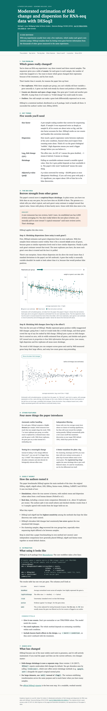
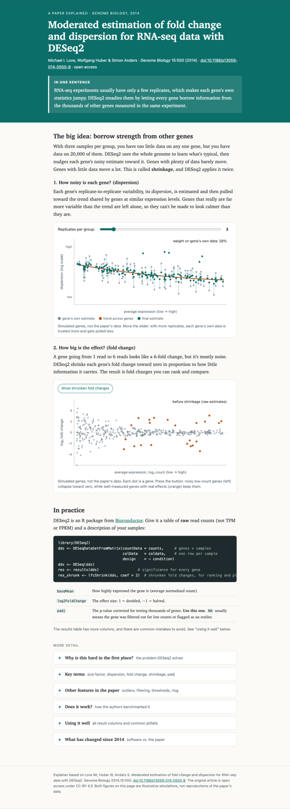
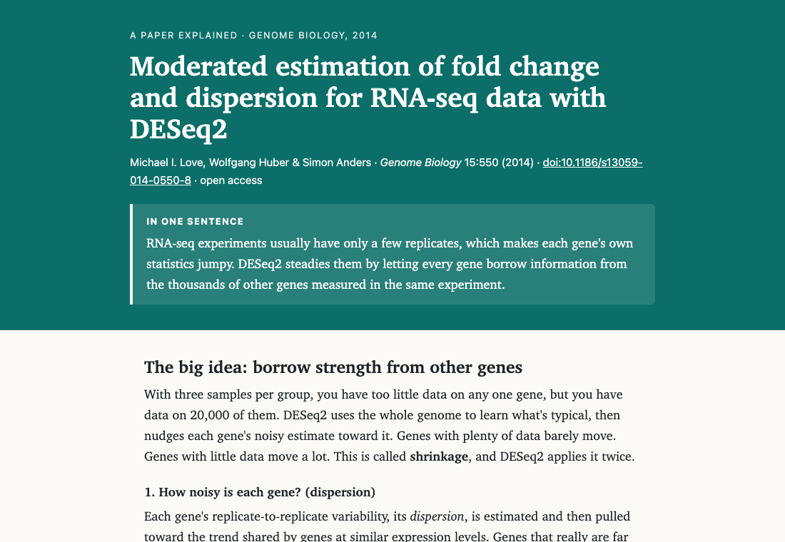
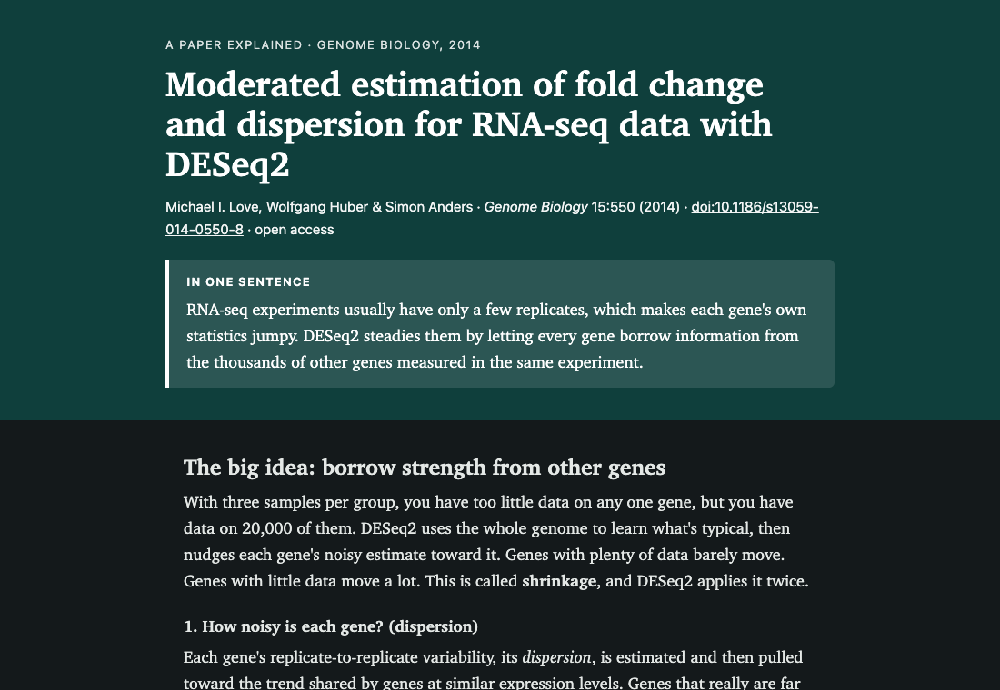

# Build a website {#sec-website}

Ask a chatbot for a web page and you get a block of code in the chat window. Then the
work is yours: copy it, find a text editor, save it with the right name and extension,
find the file, open it, notice something's wrong, go back, paste the error in, copy
the new version, save it again. The chatbot **says** things. Everything that happens
on your computer, you do.

Ask an agent for the same page and a file appears in your folder. It reads what you
point it at, writes the file, often tries to check it, and tells you where the file
is. You double-click it and it opens in your browser. That difference is the whole
of this morning's first part, and a website is the quickest way to feel it: it takes
a few minutes, needs nothing installed, and you can judge the result by looking at it.

It also shows you the other half of the day early. The page will be fluent and
good-looking, and somewhere on it will be something the agent made up, simplified or
guessed, stated with the same confidence as everything else. Finding that is part of
the exercise. It isn't a sign you did it wrong.

So this chapter asks for one thing up front: build the page **from something real**.
A paper, your CV, a lab web page, an ORCID record, a GitHub profile. An agent working
from a source you can check against is doing a different, better job than an agent
writing from memory. And you'll have something to check it against.

::: {.callout-tip}
## In the room?

Read down to [What to build it from](#sec-website-sources), then skip to
[Your turn](#sec-website-your-turn). Come back for the worked example later: it shows
what one real run did, and what it got wrong.
:::

## What you'll learn

- Give an agent a goal and a source, and get back a file you can open.
- Change what it made by asking in plain words, not by editing code.
- Tell the difference between what the agent did and what it says it did.
- Ask the one question that finds the weak spots: *what did you put here that I
  didn't tell you?*
- Know where your files are, including the ones you didn't ask for.

## What happens when you ask

When you send the prompt, the agent works in a loop: it decides on a step, uses a
tool (fetch a web page, read a file, write a file, run a command), looks at the
result, and decides on the next step. It keeps going until it thinks it's done, and
then it reports. @fig-website-loop shows the loop for this chapter's task.

```{mermaid}
%%| label: fig-website-loop
%%| fig-cap: "What happens between your prompt and the agent's reply. Every arrow out of the agent is a tool it uses, and the ones that reach outside your folder, such as fetching a web page, may ask your permission first."
%%| fig-alt: "Flow diagram. You give a goal and a source. The agent reads the source, writes index.html into your folder, tries to check the page, and fixes what it finds, looping back to writing. Then it reports to you, and you open the file and check it yourself."
flowchart TD
  accDescr: Flow diagram. You give a goal and a source. The agent reads the source, writes index.html into your folder, tries to check the page, and fixes what it finds, looping back to writing. Then it reports to you, and you open the file and check it yourself.
  you["You: a goal<br/>and a source"] --> read["Reads the source<br/>(web page, PDF, CV)"]
  read --> write["Writes the file<br/>into your folder"]
  write --> check["Tries to check it"]
  check -- "finds a problem" --> write
  check --> report["Reports: what it made,<br/>what it checked"]
  report --> open["You open the file<br/>and check it yourself"]
```

Two things about that loop are worth knowing before you start.

**The agent may not be able to see what it made.** Checking a web page properly means
opening it in a browser and looking. Some set-ups let the agent do that: the Claude
desktop app has a Browser pane that can open HTML files from your project, and Claude
can use it to look at and click through pages
[@url:https://code.claude.com/docs/en/desktop]. Other set-ups don't, or ask your
permission first. When it can't look, a good agent says so. A careless one says
"checked" when it means "read my own code back".

**Your own look is the check that counts.** Whatever the agent reports, you open the
page and read it against the source. That's what the rest of this book calls
verifying, and it starts here.

### What to build it from {#sec-website-sources}

The source is what keeps the page honest. @tbl-website-sources lists what works well.
Pick whichever you'd actually like a page about.

| Give it | How | A page that could be | Watch out for |
|---|---|---|---|
| **A paper** | A DOI or URL, or a PDF in your folder | A plain-language explainer for colleagues in another field | Claims that aren't in the paper |
| **Your CV** | A PDF or Word file in your folder | A personal academic home page | Your phone number and home address |
| **A lab web page** | Its URL | A refreshed, one-page version | Old news the agent presents as current |
| **An ORCID iD** | The iD, e.g. `0000-0002-1825-0097` | A publications page | Papers it adds from memory |
| **A GitHub profile** | Its URL | A page about your software | Invented descriptions of repositories |

: Sources to build from. Anything public that you'd like a page about will do. {#tbl-website-sources}

::: {.column-margin}
`0000-0002-1825-0097` is ORCID's own example iD, for the fictional Josiah Carberry.
The page at `orcid.org/<iD>` is built by JavaScript, so an agent fetching it sees an
empty shell. ORCID's public API, `pub.orcid.org`, needs no account and works; if the
agent struggles, suggest it.
:::

**Nothing to hand?** Use the DESeq2 paper, as in the worked example below
[@doi:10.1186/s13059-014-0550-8], or the open-access scBaseCount paper
[@doi:10.1016/j.cell.2026.08.025] from the Vahedi lab's repository. Step 2 of
[Your turn](#sec-website-your-turn) has a prompt that downloads it for you.

## Worked example

This is a real run, done the day before the workshop, not a tidied-up
demonstration. We used Claude Code (Opus 5.5) from the command line, in an empty
folder, and allowed it to fetch web pages and write files in the folder without
asking. Running commands still needed approval, and nobody was there to give it, so
those were refused. That makes it a fair picture of what happens when you say no to a
permission prompt. Your run will differ in the details: the same prompt never gives
the same page twice.

### The prompt

```default
Make me a one-page website about this paper: https://doi.org/10.1186/s13059-014-0550-8

It should be a single HTML file I can open by double-clicking. Write it for a
biologist who has heard of RNA-seq but never used DESeq2. When you're done, tell me
where the file is and what you checked.
```

Three parts, and each earns its place: **the source** (the DOI), **the shape of the
result** (one file, double-click), and **the reader** (a biologist new to DESeq2). The
last sentence asks for the report you'd otherwise have to drag out of it.

### What the agent did

It took about three minutes. @tbl-website-steps is its sequence of steps, from the
session record.

| Step | What it tried | What happened |
|---|---|---|
| 1 | Look the DOI up with a PubMed tool | Refused: that tool wasn't allowed in this session |
| 2 | Fetch the DOI link, then the publisher's page | The publisher redirected through a login page, three times |
| 3 | Fetch the full text from Europe PMC instead | Worked: title, authors, licence, methods |
| 4 | Write `deseq2.html` | Done: 29 KB, one file, no external files |
| 5 | Open it in a browser to look | Refused: no browser tool allowed |
| 6 | Run a structure check it wrote itself | Refused: running commands needed approval |
| 7 | Report | Said plainly that it had **not** seen the page |

: What the agent did for the first prompt. It worked round a paywall-style redirect on its own, and it was honest that it couldn't look at its own page. {#tbl-website-steps}

Its report began: *"I've built the page, but I couldn't open it in a browser or run
any checks on it, so you're the first to actually see it."* It then listed what it
had checked (the paper's details, against the full text), what came from its own
knowledge rather than the paper (a section on how DESeq2 has changed since 2014), and
what it couldn't check at all. That is the report you want. Not every run gives it,
which is why the prompt asked.

The page itself was good. It opened with a one-sentence summary, had two interactive
diagrams, one for each kind of shrinkage the paper describes, and ended with the
R code and a table explaining each results column. It was also **seven screens
long**.

::: {.callout-note}
## A file you didn't ask for

Step 6 left a second file in the folder: `.check_html.py`, a small script for
checking the page. The agent mentioned it at the end of its report. The name starts
with a dot, so **Finder and File Explorer hide it by default**. Nothing is wrong
with it, but it's a good reason to ask, now and then, *"list every file you created
in this folder, including hidden ones"*.
:::

### Two changes, by asking

Nobody edited any code. The first change was about length:

```default
It's too long for someone skimming. Cut it down so the main story fits on about two
screens: keep the one-sentence summary, the big idea with both diagrams, and
'in practice'. Put everything else behind 'more detail' sections I can click open.
```

A minute and a half later the page was under half the length, with six click-to-open
sections at the bottom (@fig-website-length). The agent said it had come out at
"about two and a half screens", over the target, and offered what to cut next. It
also made a change **nobody asked for**: it added a line of R code, `lfcShrink()`,
explaining that without it the code wouldn't do what the page describes. That might
be a good change. It's still worth noticing, because it's code a reader will copy.

::: {#fig-website-length layout-ncol=2}

{#fig-website-first width="60%" fig-alt="A long web page shown in full, scaled down: a green header, then seven sections with text, two diagrams, a code block and a table."}

{#fig-website-short width="60%" fig-alt="The same page after shortening, less than half the length: header, the big idea with two diagrams, a short code section, then a list of collapsed 'more detail' sections."}

The same page before and after one plain-English request, at the same scale. Click
either to enlarge.
:::

The second change took 45 seconds:

```default
Add a dark mode that follows my computer's light/dark setting.
```

It did (@fig-website-modes), and explained that the diagrams' colours had been fixed
in the code, so it moved them into the style sheet to make the diagrams switch too.
Again it said it hadn't seen the result.

::: {#fig-website-modes layout-ncol=2}

{#fig-website-light fig-alt="Top of the finished page in light mode: a dark green header with the paper title, authors and a one-sentence summary, then the heading 'The big idea: borrow strength from other genes' on a cream background."}

{#fig-website-dark fig-alt="The same part of the page in dark mode: a darker green header and near-black background with light text."}

The finished page, as Chrome showed it with the computer set to light and to dark.
:::

### The question that finds the weak spots

Then we asked the question this chapter is really about:

```default
What did you put on this page that I didn't tell you and you couldn't have checked?
List it, most important first.
```

The answer was long and candid. Its first sentence: *"Almost everything I added came
from my own memory rather than a source I read."* The highlights:

- **The `lfcShrink()` line it had added was untested.** It believed the line might
  fail unless a second package (`apeglm`) was installed, and that it only suited a
  simple two-group design. Neither caveat was on the page.
- **The "since 2014" section** was entirely from memory.
- **Even the facts "from the paper" came second-hand.** Its web-fetching tool passes
  pages through a smaller model that summarises them, so it never saw the paper's own
  wording.
- **One diagram flattered the method.** @fig-website-diagram shows it. The orange
  dots are the "real effects", and every one of them is a well-measured gene. Real
  effects in low-count genes, which shrinkage *does* pull towards zero, were drawn
  grey. The diagram hid the main cost of the method it was explaining.

{#fig-website-diagram fig-alt="Scatter plot of log2 fold change against average expression. Grey dots cluster tightly around zero; about twenty orange dots, all at moderate to high expression, sit between about -3 and +3."}

None of these is a disaster. All of them would have gone on the page, looking exactly
as authoritative as the correct parts, if nobody had asked.

### What we checked ourselves

The agent never saw its page, so we checked it outside that session, in Chrome. To be
exact about "we": these checks were made by a second agent, the one writing this
chapter, driving a real Chrome window, and Sean hasn't repeated them. Each one is
something you can do by hand in a minute:

- it opened from the file with **no errors** in the browser's console;
- the replicates slider moved the diagram (the "weight on gene's own data" label went
  from 28% to 72%), and the shrinkage button redrew the second diagram;
- all six "more detail" sections opened;
- the three links on the page (the DOI and two Bioconductor pages) all loaded;
- the title, authors, journal and year matched the DOI's record at Crossref;
- dark mode switched with the computer's setting.

**What we didn't check:** the statistics on the page against the paper's text, or
whether the `lfcShrink()` line runs. The agent's list tells us exactly where to look
if we wanted to publish this page. For a first run, knowing *where* it's weak is
the result.

## Your turn {#sec-website-your-turn}

Allow about 20 minutes. Make one page, change it once (twice if you have time), and ask
the question.

### 1. Make a folder and start a session there

Inside your `agents-workshop` folder from [Setup](00-setup.qmd), make a new folder called
`website`. Start a **new** session with `website` as its folder, the same way you did
in [Setup](00-setup.qmd). Then ask it:

```default
What folder are you working in?
```

If the answer doesn't end in `agents-workshop/website` (or `agents-workshop\website` on
Windows), stop and start the session again in the right folder.

### 2. Choose your source

Pick one thing from @tbl-website-sources. If it's a file (a PDF of a paper, your CV),
copy it into the `website` folder. If it's a URL, a DOI or an ORCID iD, just have it
ready to paste.

**Nothing to hand?** Paste the DESeq2 paper's DOI, `10.1186/s13059-014-0550-8`, into
step 3's prompt. Or have the agent fetch the scBaseCount paper, a PDF, into your folder:

```default
Download this file into this folder, saved as scbasecount_paper.pdf:
https://raw.githubusercontent.com/golnazvahedi/epigenetics-agentic-workshop/main/track-a/data/scbasecount_paper.pdf
Save the exact file (with curl, or Invoke-WebRequest on Windows); don't retype or
summarise it. Then tell me its size.
```

It should be about 5.7 MB. Then use "the PDF in this folder" as the source in step 3.

**Lost, or the download didn't work?** Download the files yourself and move them from
your Downloads folder into `website`:

- the scBaseCount paper:
  [scbasecount_paper.pdf](https://raw.githubusercontent.com/golnazvahedi/epigenetics-agentic-workshop/main/track-a/data/scbasecount_paper.pdf)
  (5.7 MB);
- the DESeq2 paper, if you'd rather work from its PDF than its DOI:
  [the PDF from Genome Biology](https://genomebiology.biomedcentral.com/counter/pdf/10.1186/s13059-014-0550-8.pdf)
  (2.4 MB).

::: {.callout-important}
## Privacy: only what you'd put on a public page

Anything you give the agent is sent to the model provider. And whatever's in your
source may end up on the page.

- **A CV usually has your phone number and home address.** Delete them from a copy
  first, or tell the agent in the prompt to leave all contact details out, and then
  check it did.
- **Don't use an unpublished manuscript**, a grant, or anything about patients or
  participants.
- A published paper, a public lab page, an ORCID record: all fine.
:::

### 3. Ask for the page

Adapt this. Replace the parts in angle brackets, and keep the last sentence.

```default
Make me a one-page website about <what the page is about>, using <the source: a URL,
a DOI, an ORCID iD, or "the PDF in this folder">.

Make it a single HTML file called index.html that I can open by double-clicking. It's
for <who will read it>. When you're done, tell me where the file is and what you
checked.
```

For example: *"… about my research, using my CV in this folder (leave out my phone
number and address) … It's for prospective students."*

The agent will probably ask permission to fetch a web page or read a file. Saying yes
to fetching the source you gave it is fine. If it asks to **install** something,
such as a web framework or a Node package, say no and remind it: one HTML file,
nothing installed. A page like this doesn't need anything more.

### 4. Open it

Find `index.html` in your `website` folder and double-click it. It opens in your
default browser.

In the Claude desktop app you can also click the file's path where it appears in the
chat, and it opens in the app's Browser pane. Or ask the agent to open it for you.

::: {.callout-note collapse="true"}
## On Windows

- **You may see `index` rather than `index.html`**: see @sec-windows.
- **If it opens in a text editor or asks which app to use,** right-click it, choose
  **Open with**, and pick Edge or Chrome.
- **Can't find the folder?** Ask the agent: *"Open this folder in File Explorer."*
:::

Now read it against your source. Is everything on the page true? Is anything missing
that you'd expect? Is there anything you didn't give it, such as a date, a claim, a
co-author, an award?

### 5. Change it

Make **one** change by asking. Say what you want, not how to do it. If you have time,
make a second; it's optional. Ideas, if you need them:

| If the page… | Try asking |
|---|---|
| is too long | "Cut it to two screens. Put the rest behind click-to-open sections." |
| lists no publications | "Add a publications list, newest first, each with a DOI link." |
| looks generic | "Make it look like a <lab website / journal / poster>." |
| is hard to read | "Bigger text, more space between sections." |
| has no dark mode | "Add a dark mode that follows my computer's setting." |
| works badly on a phone | "Make it work on a phone screen." |

: Things to ask for. One change per prompt makes it easier to see what each did. {#tbl-website-changes}

After a change, reload the page in your browser (**Cmd+R** on a Mac, **Ctrl+R** or
**F5** on Windows) and look.

### 6. Ask the question

```default
What did you put on this page that I didn't tell you and you couldn't have checked?
List it, most important first.
```

Read the list. Pick **one** item and check it yourself against your source, a search,
or what you know. Was the agent right to flag it?

## What to notice

- **It wrote files.** Not text in a chat, a file on your disk that works without the
  agent. Ask it to list everything it created, including hidden files; you may find
  more than `index.html`.
- **Nothing was installed.** One HTML file runs in any browser. If your agent reached
  for a framework, it made the job bigger than it needed to be.
- **What it said it checked, and what it could have checked.** Could it see the page?
  If it said the page "looks good", ask how it knows. In the worked example it
  couldn't look, and said so. Yours might have looked, through a browser tool, or
  might have claimed to without being able to.
- **It added things.** A section, an analogy, a line of code, a job title. Some
  additions are helpful. Every one is something you didn't ask for and need to check.
- **Figures that look like data.** A diagram or chart the agent drew is an
  illustration unless it came from real numbers you gave it. The page should say so.

## Check yourself

::: {.callout-tip}
## You're done when

- [ ] `index.html` is in your `website` folder, and it opens when you double-click it.
- [ ] You've changed it at least once, by asking, and seen the change in the browser.
- [ ] You asked what it couldn't have checked, and you checked one item yourself.
- [ ] You can say one thing on the page that was wrong, invented or unsupported, or
      you looked hard and found nothing. ("Found nothing" is a real answer. Say how
      hard you looked.)
:::

::: {.callout-important}
## Keep the folder

Don't delete the `website` folder. @sec-ledger comes back to this page and asks you to
write down what you asked, what the agent did and how you checked it. It helps to
have your prompts to hand, so if your agent doesn't keep a visible history, copy them
into a note now.
:::

## Going further

- **Try the same prompt in a chatbot**, such as claude.ai's chat or ChatGPT, and count
  the steps between its answer and a page you can open.
- **Ask it to check its own work, differently.** *"Check every fact on the page
  against the source, and list any you couldn't find in it."* Compare the answer with
  the step 6 list.
- **Put it online?** Not yet. A public page is worth publishing only once you've
  checked every claim on it. @sec-project covers keeping a project like this under
  version control, and GitHub Pages is one free way to publish it.
