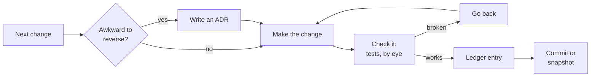
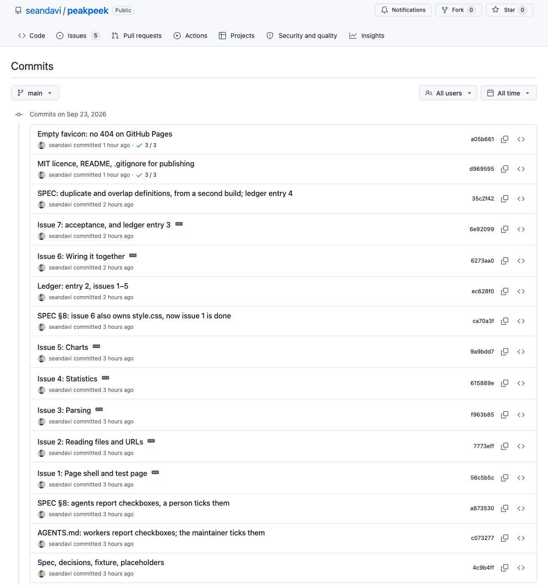
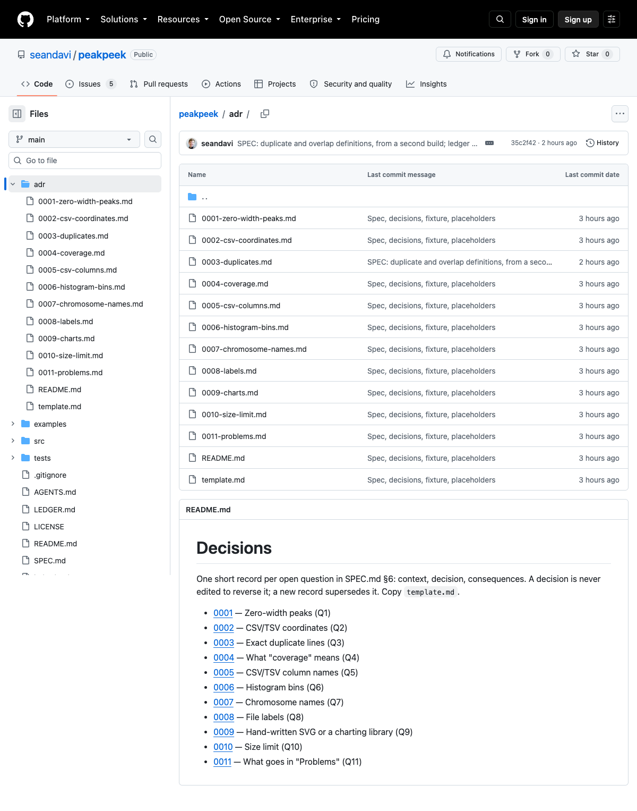
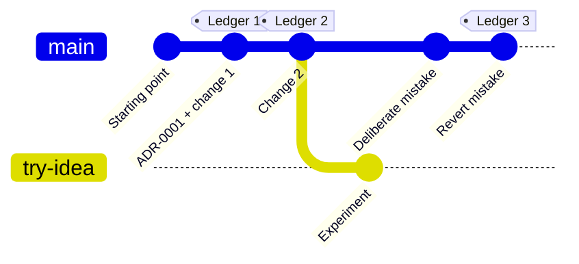

# 7  Work like a project

The app you built in [Chapter 6: Build an app](https://seandavi.github.io/2026-penn-epigen-agentic-workshop/chapters/06-build-an-app.llms.md) is finished in the sense that it works. If you never open it again, that’s enough. But most useful things get opened again. Next month you’ll want it to read another file format, a colleague will ask why it rounds the way it does, and you’ll ask an agent to make “one small change” that quietly breaks something you checked by hand three weeks ago.

At that point two questions matter, and a chat transcript answers neither. The first is **why is it like this?** Somebody chose to reject zero-width peaks, or to draw charts without a library, or to treat CSV coordinates as 0-based. If that choice isn’t written down, the next person to touch the code, and the agent most of all, will “fix” it. An agent tidying code can’t tell a deliberate decision from an accident. The second is **how do I get back?** Agents edit many files quickly and confidently. When a change goes wrong you want to return to the last version that worked, exactly, without remembering what it looked like.

Software projects settled both questions long ago, and the answers are cheap. This chapter adds three habits to the app you already have: the **ledger** from [Chapter 2: The ledger](https://seandavi.github.io/2026-penn-epigen-agentic-workshop/chapters/02-ledger.llms.md), for every change; **decision records**, for the few choices that would be awkward to undo; and **git**, the undo button, if you have it or can install it. If you can’t, you’ll keep dated copies of the folder instead, and that is fine.

You don’t have to type git commands, or remember them. The agent runs them. Your job is the same as everywhere else in this book: say what you want, and check what happened.

## 7.1 What you’ll learn

- Why a project you’ll come back to needs a record of **what was decided and why**, not just what the code does.
- How to write a short **architecture decision record** (ADR), and why “must not” in a file called `adr/` works on agents as well as people.
- How to have the agent **commit** each change with a real message, show you the history, and **go back** when something breaks.
- What to do instead if git isn’t available: **snapshots**.
- Where to go next: GitHub, issues and pull requests.

## 7.2 Three records, three questions

Each habit answers a different question, and they don’t replace each other ([Table 7.1](#tbl-project-records)). The ledger is the story of your work with the agent: what you asked, what it did, how you checked. A decision record is the reason behind one choice, written once and kept. A commit is the exact change to the files, with a way back.

|  | Answers | Write one | Who reads it | Changed later? |
|----|----|----|----|----|
| **Ledger entry** | What did I ask, what happened, how did I check? | For each piece of work worth recording | You, a reviewer, your PI | No: add a new entry |
| **Decision record** | Why is it this way? What must not change? | Only for choices awkward to reverse | The next person, and the agent before it edits | No: a new record supersedes it |
| **Commit** | What exactly changed, and when? | For every change that works | git, and anyone going back | No: history is kept |
| **Snapshot** (no git) | How do I get back? | Before every change | You, when something breaks | No: make a new one |

Table 7.1: What each record is for. None is edited to rewrite the past.

A useful rhythm is one loop per change ([Figure 7.1](#fig-project-loop)). Decide whether it’s a decision worth recording; if so, write the record first, so the agent builds to it. Make the change. Check it. Write the ledger entry. Commit.



Figure 7.1: One loop per change. The decision record comes first, when there is one, so the agent builds to it. Nothing is committed that hasn’t been checked.

### 7.2.1 Decision records

An **architecture decision record** is a short numbered file, one per decision, with three parts: the **context** that forced a choice, the **decision**, and its **consequences**, good and bad. Michael Nygard proposed the format in 2011, for software teams that kept losing the reasons behind their own designs ([“Documenting Architecture Decisions” 2011](#ref-url:https://cognitect.com/blog/2011/11/15/documenting-architecture-decisions)). They live together in a folder called `adr/`, numbered in order: `0001-…md`, `0002-…md`.

Two rules make them work. First, **write only the decisions that would be awkward to reverse**, or that someone would be tempted to undo: which coordinate convention a file uses, whether to depend on a library, what counts as a duplicate. “Make the button blue” isn’t one. Second, **a decision record is never edited to reverse it.** If you change your mind, you write a new record that says it supersedes the old one, and mark the old one “superseded by …”. The history of your thinking stays readable. Fixing a factual slip in the wording is fine, and it’s honest to append a short “Correction” note saying so.

This workshop keeps its own. The day you’re attending changed shape the day before it ran: [ADR-0001](https://github.com/seandavi/2026-penn-epigen-agentic-workshop/blob/main/adr/0001-taught-session-ends-at-1400.md) set a timetable, and [ADR-0007](https://github.com/seandavi/2026-penn-epigen-agentic-workshop/blob/main/adr/0007-talk-first-then-a-self-paced-book.md) superseded it. Both are still there.

Decision records turn out to suit agents unusually well. An agent reads a folder before it changes things, and it follows plain, imperative rules. “We generally prefer hand-written charts” reads to an agent as a preference it can weigh against your latest request. “The page **must not** load anything from the network” reads as a rule. Write the Decision section with *must* and *must not*, and add one line to your `AGENTS.md` ([Chapter 3: Teach the agent your project](https://seandavi.github.io/2026-penn-epigen-agentic-workshop/chapters/03-teach-your-agent.llms.md)) telling the agent to read `adr/` before changing behaviour.

### 7.2.2 Git, the undo button

**git** records the state of every file in a folder each time you **commit**, with a message saying what changed and why. You can list the history, see exactly what changed between any two points, and put the folder back the way it was. It has a reputation for being hard, and typing it by hand can be. But you won’t be typing it: the agent knows git thoroughly, and you ask in plain words.

Four ideas are enough for this chapter:

| Idea | What it means | Ask the agent |
|----|----|----|
| **Commit** | Save a checked change, with a message | “Commit this, with a message that says what and why.” |
| **History** | The list of commits | “Show me the history, one line per commit.” |
| **Diff** | Exactly what changed | “What’s changed since the last commit?” |
| **Revert** | Undo a commit by adding a new one that reverses it | “Revert the last commit.” |

Table 7.2: Enough git for this chapter.

A fifth, **branch**, is a separate line of history for an experiment. If the experiment works, you merge it back; if not, you switch back and delete it, and nothing else was touched.

Claude Code also keeps its own checkpoints: in the terminal, `/rewind` (or pressing Esc twice) can undo its file edits within a session. But it doesn’t undo changes made by commands the agent ran, and the checkpoints expire, by default after about 30 days ([“Checkpointing,” n.d.](#ref-url:https://code.claude.com/docs/en/checkpointing)). git covers everything, and keeps it.

A commit stays on your computer. Nothing goes anywhere unless you later choose to put the folder on GitHub (see “Going further”). Even so, **git keeps everything you ever committed**, so a file you commit and then delete is still in the history. Decide before your first commit what should never be in the folder’s history: data you couldn’t share, passwords, keys.

### 7.2.3 No git? Snapshots

Some laptops won’t let you install anything, and some people would rather not today. Then ignore git entirely. Before each change, ask the agent: “Copy everything in this folder except snapshots/ into snapshots//”, with a short name for what’s about to change. Going back means copying a snapshot back. You lose the tidy history and the exact diffs, but you keep the part that matters most, which is a way back to something that worked. The ledger and the decision records work exactly the same without git.

## 7.3 Worked example

[PeakPeek](https://github.com/seandavi/peakpeek) is a small browser page that summarises a peak file: widths, chromosomes, duplicates, overlaps. It’s the same app as the fallback in [Chapter 6: Build an app](https://seandavi.github.io/2026-penn-epigen-agentic-workshop/chapters/06-build-an-app.llms.md), built the long way by several agents in one afternoon, with Sean as the maintainer (an agent did most of the maintaining on his behalf, and the records say so). Its folder holds a specification, eleven decision records, a four-entry ledger and fifteen commits ([Figure 7.2](#fig-project-commits)). It’s small enough to read in ten minutes, and every record in it is real.

[](../images/project-peakpeek-commits.png "Figure 7.2: PeakPeek’s history on GitHub. Each commit is one checked piece of work, and the messages say what changed and why.")

Figure 7.2: PeakPeek’s history on GitHub. Each commit is one checked piece of work, and the messages say what changed and why.

**A decision record.** The specification left eleven questions open, and each got an ADR ([Figure 7.3](#fig-project-adr)). Here is [0009](https://github.com/seandavi/peakpeek/blob/main/adr/0009-charts.md), in full (rewrapped to fit):

``` markdown
# 0009 — Hand-written SVG or a charting library

**Status:** accepted
**Deciders:** orchestrating agent, acting for Sean Davis
(not yet reviewed by him). SPEC.md §6 Q9, suggested default taken.

## Context

A library means a CDN (network, and a third party sees the page
load) or a copy in the folder (and its licence).

## Decision

Hand-written SVG.

## Consequences

About 60 lines per chart; no dependencies at all.
```

Three short sentences. Without them, an agent asked to “make the histogram nicer” might well reach for a charting library, and the page would quietly start loading code from someone else’s server.

[](../images/project-peakpeek-adr.png "Figure 7.3: PeakPeek’s adr/ folder: one file per decision, an index, and a template to copy.")

Figure 7.3: PeakPeek’s `adr/` folder: one file per decision, an index, and a template to copy.

**A change that touched all three records.** After the first build, a second agent built the same app independently from the same spec, as a test of the spec. Wherever the two builds disagreed, the spec hadn’t said something. One disagreement showed that [ADR-0003](https://github.com/seandavi/peakpeek/blob/main/adr/0003-duplicates.md) was wrong about a fact: the CTCF file’s “exact duplicate line” was really two peaks with the same coordinates and different scores. The decision (count duplicates and flag them) still stood, so the record wasn’t rewritten. It got a “Correction” note appended. The commit that made the fix, [`35c2f42`](https://github.com/seandavi/peakpeek/commit/35c2f42), changed three files together: the spec, the ADR’s correction, and ledger entry 4, which reads in part:

> **Confidently wrong** — *Orchestrator*: SPEC §2 said CTCF has “an exact duplicate line”. It has a duplicate *peak*: same coordinates, different scores. \[…\] ADR-0003 has a correction note.
>
> **Keep** — A second independent build is a cheap test of a spec: every place the two disagree is a sentence the spec didn’t write.

**A mistake the records caught.** [Ledger entry 2](https://github.com/seandavi/peakpeek/blob/main/LEDGER.md) records that, while five agents were writing code in the same folder, the orchestrating agent committed a spec change with a command that commits *every* changed file. It swept three agents’ half-finished code into the commit. One of the other agents noticed, and the commit was redone with the spec alone. The lesson went into the ledger’s “Keep” field. You probably won’t run five agents at once, but the general point holds: **look at what a commit includes before trusting it**, which is why the prompts below ask the agent to show you.

What we checked for this section: the commit list, the ADR folder and the files quoted above, read directly from the repository on 23 September 2026. We didn’t re-run PeakPeek’s tests for this chapter; its ledger records how they were checked.

## 7.4 Your turn

You need the folder from [Chapter 6: Build an app](https://seandavi.github.io/2026-penn-epigen-agentic-workshop/chapters/06-build-an-app.llms.md), `Documents/agents-workshop/my-app`, with your app in it and its `LEDGER.md`. No app? Use the PeakPeek exercise from [Chapter 6: Build an app](https://seandavi.github.io/2026-penn-epigen-agentic-workshop/chapters/06-build-an-app.llms.md) as your starting point, or any small folder you care about. Start a new session in that folder, and ask “What folder are you in?” before anything else.

Allow 30–40 minutes. There are three steps: set up, two changes, and one deliberate mistake. With git, your history will end up looking something like [Figure 7.4](#fig-project-history).



Figure 7.4: Where this chapter’s activity leaves you: a starting point, two changes (one with a decision record), a mistake and its revert, each with a ledger entry. The optional experiment branch is never merged here, so main never sees it.

> **WARNING: Before your first commit**
>
> git keeps everything you ever commit. If the folder holds data you couldn’t share, anything identifiable, or any password or key, move it out, or have it listed in `.gitignore` so git never records it, **before** the first commit. Snapshots keep copies too: the same care applies.

### 7.4.1 1. Set up

First, find out whether you have git. Your `readiness.md` from [Setup](../chapters/00-setup.llms.md#setup-readiness) has the answer as of this morning, but ask again: you may have installed it since, and the check takes a second. Paste this:

``` default
Is git installed on this computer? Just check, and tell me the version
if so. Don't install anything yet. If it isn't installed, tell me the
simplest way to install it on my operating system, and wait for me.
```

- **macOS:** typing `git` in Terminal usually offers to install Apple’s Command Line Tools, which include git. Accept, and wait a few minutes. The agent may suggest `xcode-select --install`, which does the same.
- **Windows:** install [Git for Windows](https://git-scm.com/install/windows), or, in PowerShell, `winget install --id Git.Git -e --source winget`. Then start a new agent session so it can find git.
- **Can’t install it** (a managed laptop, or no time): skip every git step below and use the snapshot prompts instead. You lose nothing that matters for this chapter.

> **NOTE: On Windows**
>
> After installing Git for Windows, restart the Claude desktop app or your terminal before asking again. The installer’s defaults are fine. Claude Code on Windows uses git’s bundled Git Bash to run commands when it’s installed, and PowerShell when it isn’t ([“Advanced Setup,” n.d.](#ref-url:https://code.claude.com/docs/en/setup)); either works for this chapter. Folder paths will look like `snapshots\start`.
>
> **OneDrive and git can clash.** If your Documents folder is synced to OneDrive, OneDrive may lock or re-sync files inside the hidden `.git` folder while git is writing them, and the repository can end up broken. Pause OneDrive syncing while you work, or keep the project in a folder outside OneDrive (for example `C:\Users\<you>\agents-workshop`). See [Appendix A: Windows notes](https://seandavi.github.io/2026-penn-epigen-agentic-workshop/appendices/windows.llms.md) for more.

Then set up the records. **With git:**

``` default
Set this folder up as a project I'll come back to.

1. Make it a git repository. Before committing anything, add a
   .gitignore that lists snapshots/ and anything else that shouldn't
   be recorded (large data, anything private, system files like
   .DS_Store). Then show me the list of files you would commit, and
   wait for my OK. If git asks for a name and email, ask me what to
   use.
2. Create adr/ with a README.md index and a template.md: title, status
   (accepted, or superseded by ADR-NNNN), date, Context, Decision
   (written with "must" and "must not"), Consequences.
3. If there's no LEDGER.md, create one with the fields Asked, Agent
   did, Checked how, Confidently wrong, Keep.
4. Add to AGENTS.md (create it if needed): read adr/ before changing
   how the app behaves; never edit an accepted ADR to reverse it,
   write a new one that supersedes it; every change gets a ledger
   entry and a commit. If there's no CLAUDE.md, create one containing
   the single line @AGENTS.md.
5. Commit everything as the starting point, then show me the history.
```

**Without git**, replace steps 1 and 5 with:

``` default
Instead of git, keep snapshots. A snapshot means: copy everything in
this folder except snapshots/ into snapshots/<name>/. Make one before
any change, named for the change. Make the first one now, called
"start", and add the snapshot rule to AGENTS.md.
```

Check that `adr/`, `LEDGER.md`, `AGENTS.md` and `CLAUDE.md` exist, and open `AGENTS.md` to read the rules the agent wrote for itself. Are they what you asked for? (`CLAUDE.md` holds only `@AGENTS.md`, so Claude Code reads the same rules as other agents; [Chapter 3: Teach the agent your project](https://seandavi.github.io/2026-penn-epigen-agentic-workshop/chapters/03-teach-your-agent.llms.md) explains why.)

### 7.4.2 2. Two changes, the full loop

Pick two improvements to your app. Try to make one of them a real decision: something with more than one sensible answer, where you’d want to remember why you chose. Examples: what to do with missing values, which file formats to accept, whether a threshold is fixed or adjustable, whether to use a library. The other can be small.

For each, paste this, with your change filled in:

``` default
Next change: <describe it>.

1. If this involves a decision that would be awkward to reverse, write
   an ADR in adr/ first, and show it to me before building.
2. Make the change.
3. Check it: run the tests if there are any, and tell me exactly what
   I should check by hand.
4. Add a ledger entry. "Checked how" says only what was actually run
   or looked at.
5. Show me what's changed since the last commit, then commit it with a
   message that says what changed and why. Show me the history.
```

(Without git: ask for a snapshot before step 2, and leave out step 5.)

Do the hand check yourself before you let it commit. If the agent’s ADR doesn’t match what you’d decide, say so: the ADR records **your** decision, not the agent’s suggestion.

### 7.4.3 3. Break something, then go back

Now make a mistake on purpose, so you’ve seen the way back work before you need it. Choose something whose effect you’ll notice: a label, a calculation, a colour.

``` default
For practice: make a deliberate mistake in the app (for example,
<an idea>), and commit it with the message "Deliberate mistake, for
practice". Then show me the history.
```

Open the app and see the mistake. Then:

``` default
Revert the last commit, so the history keeps both the mistake and the
undo. Show me the history, and check that the app is back to how it
was. Then write one ledger entry covering both: what broke, how we
went back, and how we checked.
```

**Without git:**

``` default
For practice: copy everything in this folder except snapshots/ into
snapshots/before-mistake/. Then make a deliberate mistake
(for example, <an idea>). When I've seen it, restore the app from that
snapshot. Don't touch LEDGER.md or snapshots/ when restoring. Then
write one ledger entry covering both.
```

> **TIP: Optional: a branch for an experiment**
>
> With git, try an idea you’re unsure of on a **branch**: “Make a branch called try-dark-mode, and make the change there” (named for your idea). Look at it. Then say either “merge it into main” or “switch back to main and delete the branch”. Either way, main never saw the half-done version.

## 7.5 What to notice

- **The agent is good at git, and fast.** It knows the commands better than most people. That’s exactly why you ask it to *show* you what it’s about to commit: speed isn’t the same as checking.
- **Commit messages are for later readers, including agents.** “Update files” is useless in a month. “Reject negative widths, per ADR-0002” tells the next reader, and the next agent session, what happened and why.
- **Did the agent treat your ADR as a rule?** Try asking for a change that contradicts one. Does it stop and point to the record, or cheerfully go ahead? If it goes ahead, look at how the Decision is worded, and at whether `AGENTS.md` tells it to read `adr/`.
- **Going back felt like nothing.** That’s the point. Once going back is cheap, you can let the agent try bolder changes.

## 7.6 Check yourself

> **TIP: You’re done when**
>
> The history (“show me the history”) has at least four commits: the starting point, two changes and the revert, each with a message that says why. Or, without git, `snapshots/` has at least three folders, each named for a change.
>
> `adr/` has at least one record, in your words, with a Decision that uses *must* or *must not*.
>
> `LEDGER.md` has an entry for each change, and every “Checked how” names something that was actually run or looked at.
>
> You went back once, and the app works again.
>
> In a **new** session, “Why does this app …?”, asked about the thing your ADR decided, gets an answer from the ADR.

## 7.7 Going further

- **GitHub.** Putting the folder on GitHub adds a copy off your laptop, **issues** to track what’s next, **pull requests** so someone (or another agent) reviews a change before it lands, and automatic tests on every change. It’s also where the privacy warning above starts to matter. PeakPeek’s [issue \#1](https://github.com/seandavi/peakpeek/issues/1) sets out how to build and run it that way, step by step.
- **Learning git properly.** For R users, [*Happy Git and GitHub for the useR*](https://happygitwithr.com/) is the kindest introduction. The free [Pro Git](https://git-scm.com/book/en/v2) book is the reference.
- **More on decision records:** the templates and tools collected at [adr.github.io](https://adr.github.io/), and this workshop’s own [`adr/`](https://github.com/seandavi/2026-penn-epigen-agentic-workshop/tree/main/adr) and [`LEDGER.md`](https://github.com/seandavi/2026-penn-epigen-agentic-workshop/blob/main/LEDGER.md).

“Advanced Setup.” n.d. Accessed September 23, 2026. <https://code.claude.com/docs/en/setup>.

“Checkpointing.” n.d. Accessed September 23, 2026. <https://code.claude.com/docs/en/checkpointing>.

“Documenting Architecture Decisions.” 2011. November 15. <https://www.cognitect.com/blog/2011/11/15/documenting-architecture-decisions>.
